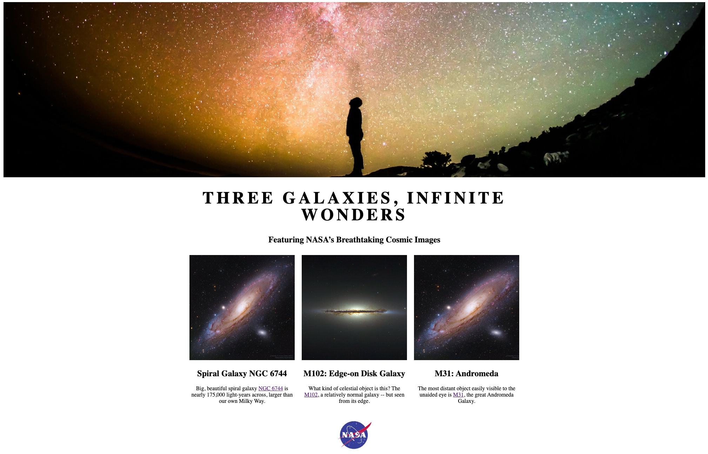

# Lab Practice: Image Manipulation

In this practice, you will learn how to manipulate images and incorporate them on a web page using HTML. Images play a crucial role in web design and development, enhancing visual appeal and user engagement with page's content. You will work on tasks such as resizing and cropping to fit your images into various layouts.

## Expected Output
After completing your lab practice, your web page should like the image below.

